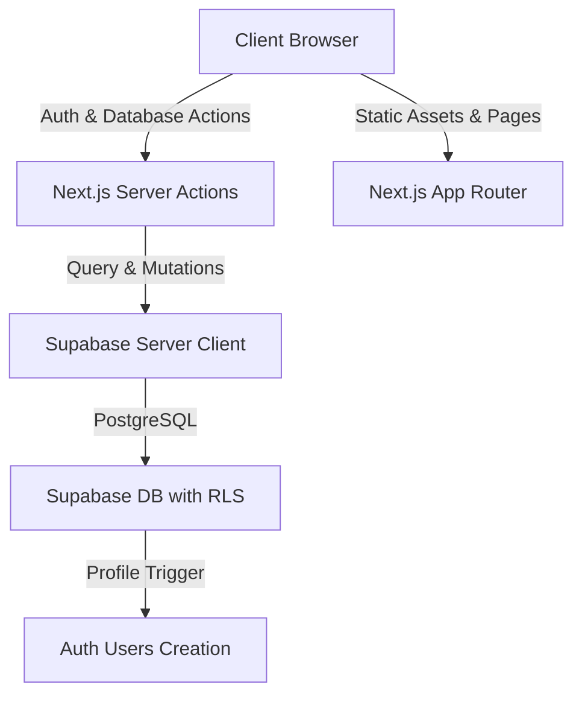

# Draftly

Draftly is a premium, high-performance collaborative document workspace built using Next.js 15, Supabase, TipTap Editor, and Tailwind CSS v4. It features real-time debounced autosave, document sharing, permission-level gating, and file imports.

---

## 🛠 Tech Stack

- **Framework**: [Next.js 15 (App Router)](https://nextjs.org/)
- **Database & Auth**: [Supabase](https://supabase.com/) with Postgres RLS
- **Rich Text Editor**: [TipTap Editor](https://tiptap.dev/)
- **Styling**: [Tailwind CSS v4](https://tailwindcss.com/)
- **State Management**: React Server Actions & Transitions
- **Form Validation**: [Zod](https://zod.dev/)

---

## 🏗 System Architecture



### 1. Authentication & Route Protection
- **Supabase SSR**: Middleware (`src/lib/supabase/middleware.ts`) automatically intercepts incoming requests to manage sessions, refreshing access tokens and redirecting unauthorized traffic:
  - Public routes: `/`, `/login`, `/signup`
  - Protected routes: `/dashboard`, `/documents/[id]`
- **Auto-Sync Profiles**: A PostgreSQL trigger `on_auth_user_created` in `supabase/migrations/001_initial_schema.sql` automatically populates the `public.profiles` table whenever a user registers.

### 2. Row Level Security (RLS)
The database enforces strict privacy constraints at the Postgres engine level:
- **Profiles**: Users can only select or update their own profile records.
- **Documents**: 
  - Owners have full CRUD capabilities.
  - Shared collaborators can only select or update documents depending on active permissions.
- **Document Shares**:
  - Document owners have complete share privileges.
  - Recipients can select their own shared records.

### 3. Rich Text Editing & Debounced Autosave
- **TipTap Core**: Configured with the `StarterKit` bundle and custom styling rules.
- **Autosave Engine**: Monitored via the TipTap `onUpdate` callback. When the user stops typing, changes trigger a **1.5-second debounced timeout** executing the `updateDocumentContentAction` server action.
- **Save Status Bar**: The editor header renders real-time sync indicators (`Synced to cloud`, `Saving changes...`, `Auto-save error`).
- **Tab Protection**: A browser `beforeunload` event handler prevents users from closing the tab while save events are in progress.

### 4. File Imports (.txt, .md)
- **Local Parsing**: Documents can be imported from local `.txt` or `.md` files.
- **Markdown Parser**: An offline regex reader translates headings (`#`, `##`, `###`), blockquotes (`>`), and standard lines of text into structured JSON nodes before database insertion.

---

## 📁 Folder Structure

```text
├── supabase/               # Migrations and SQL schemas
├── public/                 # Static assets and icons
├── src/
│   ├── app/                # Next.js App Router & Route Groups
│   │   ├── (auth)/         # Login, Signup, and Auth Layout
│   │   ├── (dashboard)/    # Dashboard and Document Editor Page
│   │   ├── globals.css     # Tailwind imports and TipTap styling rules
│   │   └── layout.tsx      # Main layout mounting ThemeProvider & Toasters
│   ├── components/         # React Components
│   │   ├── dashboard/      # Sidebar, Document Card, and Rename Dialog
│   │   ├── editor/         # Editor Toolbar and TipTap Canvas
│   │   ├── providers/      # Next-Themes provider
│   │   └── ui/             # Shadcn reusable components
│   ├── lib/                # Core utilities
│   │   ├── actions/        # Server Actions (Auth, Documents, Sharing)
│   │   ├── supabase/       # SSR client, server, and middleware helpers
│   │   ├── utils/          # Utility functions
│   │   └── validations/    # Zod validation schemas
│   └── types/              # TypeScript types and Database interface
```

---

## 🚀 Getting Started

### 1. Prerequisites
- **Node.js** (v20+)
- **pnpm** (v11+)
- **Supabase CLI** (Optional, for local development)

### 2. Database Setup
Ensure your Supabase project contains the initial schemas. Apply the migration SQL:
```bash
# Run migrations using Supabase CLI
supabase db push
# Or copy the content from supabase/migrations/001_initial_schema.sql directly into the Supabase SQL Editor
```

### 3. Environment Variables
Create a `.env.local` file in the root directory:
```bash
NEXT_PUBLIC_SUPABASE_URL=https://your-project-id.supabase.co
NEXT_PUBLIC_SUPABASE_ANON_KEY=your-anonymous-key
```

### 4. Installation & Local Development
```bash
# Install dependencies
pnpm install

# Approve postinstall builds
pnpm approve-builds

# Run development server
pnpm dev
```
Open [http://localhost:3000](http://localhost:3000) to view the application.

### 5. Build for Production
To build the application for deployment:
```bash
pnpm build
```

---

## 🌐 Production Deployment

Deploy the application to **Vercel** with the following options:
1. Link your GitHub repository to Vercel.
2. Configure **Environment Variables** (`NEXT_PUBLIC_SUPABASE_URL`, `NEXT_PUBLIC_SUPABASE_ANON_KEY`) in the project settings.
3. Vercel will automatically detect Next.js configurations and execute `npm run build`.
