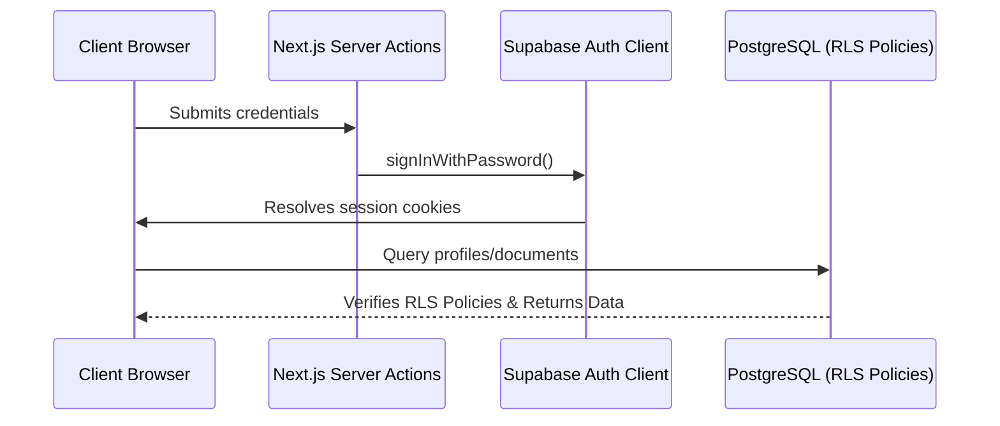

# 📝 Draftly — Premium Collaborative Workspace

Draftly is a high-performance, collaborative document editor built on modern web technologies. Featuring real-time autosaving, strict security controls, and document sharing, it provides a workspace experience designed to impress.

---

## ✨ Features Highlight

*   **⚡ Real-Time Debounced Autosave**: Saves changes automatically after 1.5 seconds of user inactivity with live header indicators.
*   **🔒 Secure Document Sharing**: Grant Viewer or Editor access permissions to users by email address.
*   **📁 File Import (.txt & .md)**: Parses and loads local files directly into formatted editor nodes.
*   **👁️ viewer Enforced Modes**: Viewers are locked into a secure read-only mode where edit triggers and toolbars are hidden.
*   **🛡️ Postgres Row Level Security (RLS)**: Fine-grained security policies enforced directly at the database engine level.

---

## 🛠️ Tech Stack & Dev Tooling

| Layer | Technology |
| :--- | :--- |
| **Framework** | Next.js 15 (App Router, Server Actions, Transitions) |
| **Database & Auth** | Supabase (PostgreSQL, Row Level Security) |
| **Rich Text Engine** | TipTap Editor Framework |
| **Styles & Theme** | Tailwind CSS v4 (Glassmorphic layouts, Dark-mode aesthetics) |
| **Form Safety** | Zod (Schemas validation) |
| **Build System** | pnpm v11 package manager |

---

## 🏗️ System Architecture & Mechanics



### 1. The Autosave Engine
To avoid redundant network requests, Draftly implements a custom debounced saving hook:
*   **Callback**: TipTap’s `onUpdate` listener triggers when a user modifies text.
*   **Debounce (1500ms)**: The save timeout resets on keystrokes. Once typing pauses for 1.5 seconds, `updateDocumentContentAction` is dispatched.
*   **Visual States**: Indicates `Synced`, `Saving...`, or `Error` in the editor navigation header.
*   **Loss Prevention**: Intercepts browser `beforeunload` events to prevent tab closure while saving is active.

### 2. Solving RLS Infinite Recursion (Postgres Architecture)
A major challenge in collaborative RLS architectures is circular policy execution. For example:
- Checking if a user can **read a document** requires checking their permissions in the `document_shares` table.
- Checking if a user can **read a share** requires checking if they are the owner in the `documents` table.

This creates a loop causing PostgreSQL to throw `infinite recursion detected (42P17)`.

#### 💡 The Solution: Security Definer Helper
Draftly resolves this circular reference by executing the check inside a `security definer` helper function that queries the tables bypassing RLS rules:

```sql
create or replace function public.check_document_owner(doc_id uuid, user_id uuid)
returns boolean
security definer
set search_path = public
as $$
begin
  return exists (
    select 1 from public.documents
    where id = doc_id and owner_id = user_id
  );
end;
$$ language plpgsql;
```

This function is then hooked directly into the RLS policies:
```sql
create policy "Owners can manage shares"
  on public.document_shares for all
  using (public.check_document_owner(document_id, auth.uid()));
```

---

## 📁 Repository Structure

```text
├── supabase/               # Migrations and SQL schemas
├── public/                 # Static assets and icons
├── src/
│   ├── app/                # Next.js App Router (Auth/Dashboard layouts)
│   │   ├── (auth)/         # LoginPage, SignupPage
│   │   ├── (dashboard)/    # Dashboard list & TipTap editor view
│   │   ├── globals.css     # CSS rules & TipTap styles
│   │   └── middleware.ts   # Edge Session validation
│   ├── components/         # React Components
│   │   ├── dashboard/      # Sidebar, Document Card, Rename Dialog
│   │   ├── editor/         # Editor Toolbar, Share Dialog
│   │   └── ui/             # Reusable design assets
│   ├── lib/                # Backend Actions & Supabase instances
│   └── types/              # Database schema typings
```

---

## 🚀 Local Installation & Run

### 1. Prerequisites
- **Node.js** (v20+)
- **pnpm** (v11+)

### 2. Database Migration Setup
Apply the schema and security policies to your Supabase instance:
1. Copy the contents of `supabase/migrations/001_initial_schema.sql`.
2. Paste it in your **Supabase Project SQL Editor** and click **Run**.
3. In **Authentication -> Providers -> Email**, disable the **Confirm email** toggle.

### 3. Environment Variables
Create a `.env.local` file in your root directory:
```bash
NEXT_PUBLIC_SUPABASE_URL=https://your-project-id.supabase.co
NEXT_PUBLIC_SUPABASE_ANON_KEY=your-anonymous-anon-key
```

### 4. Running the Project
```bash
# Install dependencies
pnpm install

# Build dev server
pnpm dev
```
Access the application at `http://localhost:3000`.

---

## 🌐 Production Deployments

### Netlify Deployment
Draftly is pre-configured for Netlify hosting out of the box using **`netlify.toml`**:

1. Link your GitHub repository to Netlify.
2. Add your Supabase keys under **Environment variables** (`NEXT_PUBLIC_SUPABASE_URL`, `NEXT_PUBLIC_SUPABASE_ANON_KEY`).
3. Under **Build & deploy settings**, keep **Base directory** empty/blank and **Publish directory** as `.next`.
4. Netlify automatically loads the `@netlify/plugin-nextjs` runtime to handle Next.js SSR functions.
